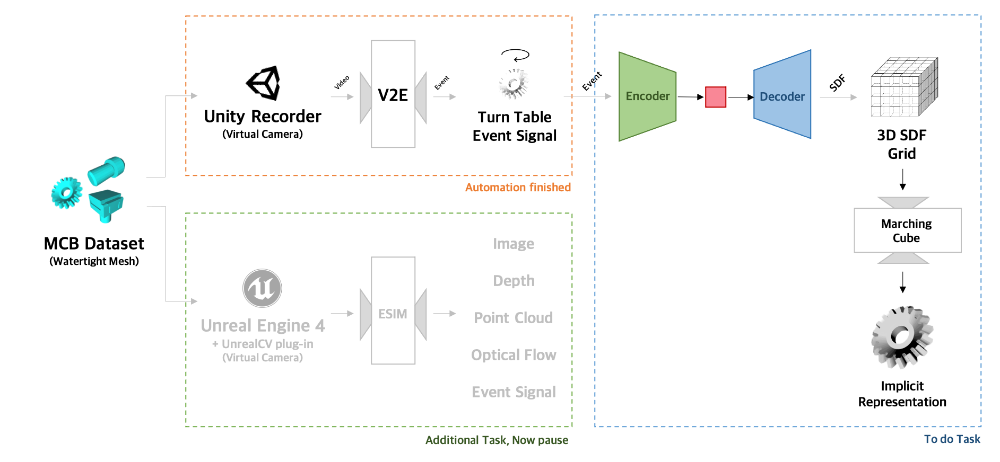

# Event-based-3D-Reconstruction

## Pipeline Draft

## Resources

### Synthetic Dataset Generation
Using UnrealCV & ESIM, we will generate **Camera Poses, Frames, GT Depth Maps, GT Point Clouds, Event Signal** about MCB Dataset.

- UnrealCV ([Github](https://github.com/unrealcv/unrealcv), [Project](https://unrealcv.org/))
- ESIM ([Github](https://github.com/uzh-rpg/rpg_esim#esim-an-open-event-camera-simulator))
- MCB Dataset ([Github](https://github.com/stnoah1/mcb), [Project](https://mechanical-components.herokuapp.com/))

## Personal Docs
#### 1. Unreal Engine 4 Build for Ubuntu 16.04
##### Clone with Git
You should register your GitHub account for **Epic Games** before clonning.
```
$ git clone https://github.com/EpicGames/UnrealEngine.git --branch 4.16
$ cd UnrealEngine
$ ls -la
```
##### Building UE4 on Linux
May take anywhere from ten minutes to over an hour to compile the engine.
```
$ ./Setup.sh
$ ./GenerateProjectFiles.sh
$ make
```
##### Running UE4 on Linux
If you run UE4 first time, it may install surface binary for a time.
```
$ cd Engine/Binaries/Linux
$ ./UE4Editor
```
